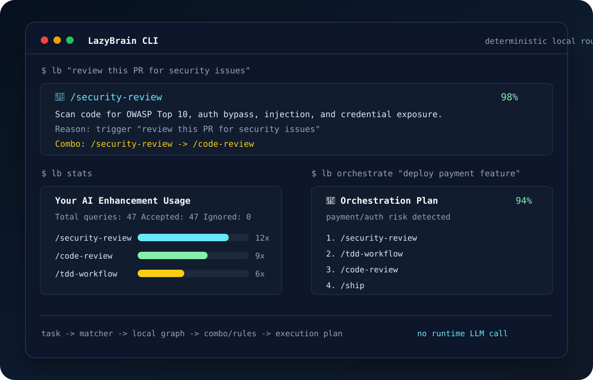

# LazyBrain

You installed 300 AI skills. You remember 20. LazyBrain finds and orchestrates the rest.



## Install

```bash
npm install -g lazybrain
lb quickstart
lb "review this PR for security issues"
```

## Why

- Your agent stack grows faster than your memory.
- LazyBrain maps a plain task to the right skill, plugin, or workflow combo.
- The hook stays quiet unless confidence is high.

## Features

```bash
lb "task"                 # best matching capability
lb stats                  # usage patterns and growth
lb discover               # unused high-value skills
lb combo "deploy feature" # workflow template
lb orchestrate "task"     # multi-skill orchestration plan
lb scan && lb compile     # local skills/rules knowledge graph
```

## Works With

Claude Code, Cursor, Windsurf, Cline, Aider, Codex, GitHub, Vercel, Browser, and local `SKILL.md` directories.

## How It Works

```text
task text
  -> tag + example matcher
  -> optional local graph merge
  -> deterministic combo/rule engine
  -> CLI, hook, statusline
```

No runtime LLM call. No embedding dependency on the hot path. High-confidence hook suggestions use `systemMessage`; low-confidence cases stay silent.

## Development

```bash
npm ci
npm run lint
npm test
npm run build
node dist/bin/lazybrain.js quickstart
```

Contributions should improve built-in triggers, golden-set precision, scanner coverage, or orchestration rules.
