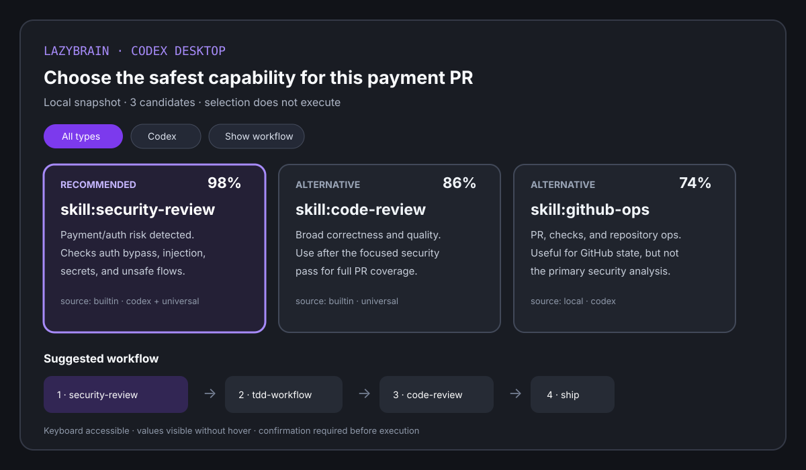

# LazyBrain — Codex 桌面版能力路由器

> 直接在 Codex 桌面版里描述任务。LazyBrain 搜索本机 Skills、Plugins、MCP servers、agents 和 commands，告诉你该用什么、为什么；需要比较时，再交给 `@Visualize` 生成可交互决策界面。

[](https://www.npmjs.com/package/lazybrain)
[](package.json)
[](LICENSE)
[](package.json)



LazyBrain 是面向 Codex 桌面版的本地能力索引和确定性路由器。它盘点本机 Skills、Plugins、MCP server 元数据、agents、slash commands、rules 和 workflow templates，再把一句自然语言任务——包括模糊提示词——变成可解释的推荐、比较、澄清问题或执行顺序。

它适合已经装了很多 agent 能力、但不想每次记准确命令名的开发者。

```bash
npm install -g lazybrain
lb quickstart
lb ask "安全地审查这个支付 PR"
```

## 为什么需要 LazyBrain

| 问题 | LazyBrain 给你的结果 |
| --- | --- |
| skills、commands、rules 太多，记不住 | 一个自然语言入口 |
| agent 随机选工具或套通用流程 | 确定性的本地路由 |
| 模糊提示词可能匹配多个工具 | 给出一个推荐、取舍，或先问一个澄清问题 |
| 发布、安全、迁移、review 这类任务反复做 | 可复用 combo 和编排计划 |
| hook 提示太吵 | 只在高置信度时提示 |
| 担心扫描文件离开本机 | 本地图谱、本地缓存、无 telemetry |

## 当前能力

| 使用面 | 状态 | 用途 |
| --- | --- | --- |
| Codex 桌面版 plugin + bundled Skill | 本地 checkout 可用 | 在会话里搜索、选择和比较本机能力，并在可用时调用 `@Visualize` |
| `lb` CLI | 支撑面 | 初始化图谱、检查决策、调试桌面版后端 |
| Claude Code hook | 可用 | 在项目内自动给高置信度建议 |
| `lazybrain-mcp` | 可用 | 给支持 MCP 的 agent 客户端做确定性路由 |
| 本地图谱/cache | 可用 | 基于本机 capability metadata 快速匹配 |
| Hosted dashboard | 未包含 | 当前 beta 没有云端 UI 或团队同步 |
| 自动执行任务 | 未包含 | LazyBrain 负责推荐和规划，执行仍由 agent 完成 |

当前版本：`2.1.0`。

## 安装

要求 Node.js 18 或更新版本。

```bash
npm install -g lazybrain
lb quickstart
lb ready
```

`npm install` 只安装 CLI，不会自动扫描你的 home 目录。`lb quickstart` 才是显式首次运行命令：扫描本机 capability metadata，并生成 `~/.lazybrain/graph.json`。

Beta channel：

```bash
npm install -g lazybrain@beta
```

v2.1.0 发布后可用的 GitHub release tarball：

```bash
npm install -g https://github.com/papperrollinggery/lazy-brain/releases/download/v2.1.0/lazybrain-2.1.0.tgz
```

源码安装：

```bash
git clone https://github.com/papperrollinggery/lazy-brain.git
cd lazy-brain
npm ci
npm run build
npm link
lb quickstart
lb ready
```

完整安装、旧版本清理、MCP 和 smoke test 说明见：[docs/INSTALL.md](docs/INSTALL.md)。

### Codex 桌面版快速开始

```bash
npm ci
npm run build
npm link
codex plugin marketplace add .
codex plugin add lazybrain@lazybrain-local
```

安装后新建 Codex 桌面版 task，直接问：“审查并安全发布这个支付 PR，我该用本机哪个能力？”需要交互比较时，先在 composer 中显式选择 `@Visualize` 再发送。LazyBrain 会调用只读推荐工具；当 `desktopVisualization.shouldRender` 为 `true` 且当前 task 已暴露 `@Visualize` 时，Skill 才会把原始提示词交给它。若预览不可用或未选择，则返回无障碍 Markdown 表格和可复用的精确 prompt。详见 [Codex Desktop 集成](docs/CODEX_DESKTOP.md)。

## 快速演示

查任务该用哪个能力：

```bash
lb "review this PR for security issues"
```

把模糊提示词转换成供 Codex、Claude Code 或其他客户端读取的结构化决策：

```bash
lb ask "帮我安全地完成这个任务" --json
```

查看 Codex 桌面版交互契约：

```bash
lb desktop "安全地审查这个支付 PR" --json
lb desktop "安全地审查这个支付 PR" --visualize-prompt
```

决策契约默认 fail-closed：置信度不足时返回 `clarify`，不会静默猜一个工具。

示例输出：

```text
/security-review 98%
Scan code for OWASP Top 10, auth bypass, injection, and credential exposure.

Also consider:
- /code-review
- /gitnexus-pr-review
```

把高风险任务变成有顺序的计划：

```bash
lb orchestrate "deploy payment feature"
```

选择可复用 workflow：

```bash
lb combo "deploy new feature to production"
```

给当前项目安装安静的 Claude Code 自动建议：

```bash
lb hook install
lb hook status
```

hook 安装后，你继续在 Claude Code 里正常输入任务即可。LazyBrain 只在匹配足够确定时追加建议。

## 常用命令

| 命令 | 用途 |
| --- | --- |
| `lb "task"` | 匹配最合适的 capability |
| `lb ask "task"` | 选择、比较或澄清；加 `--json` 供 agent 和 visualization 使用 |
| `lb desktop "task"` | 返回 Codex 桌面版 `@Visualize` 数据、无障碍 fallback 或精确可视化提示词 |
| `lb use <name> [task]` | 显式记录你确实采用了某项推荐 |
| `lb combo "task"` | 返回可复用 workflow 模板 |
| `lb orchestrate "task"` | 生成多 skill 编排计划 |
| `lb scan` | 扫描本机 capability 文件 |
| `lb compile` | 重建本地 capability 图谱；不调用 LLM 或 embedding |
| `lb quickstart` | 首次使用的一键扫描和编译 |
| `lb stats` | 查看最近使用情况和模式 |
| `lb discover` | 发现高价值但未使用的本机能力 |
| `lb config show` | 查看脱敏后的本地配置 |
| `lb ready` / `lb ready --json` | 检查图谱和 hook 是否可用 |
| `lb hook plan` | 查看将要写入的 hook 变更 |
| `lb hook install` | 安装当前项目的 Claude Code hook |
| `lb hook uninstall` | 移除当前项目 hook |
| `lazybrain-mcp` | 启动 stdio MCP server |

## MCP

给支持 MCP 的客户端添加：

```json
{
  "mcpServers": {
    "lazybrain": {
      "command": "lazybrain-mcp",
      "args": []
    }
  }
}
```

源码 checkout 版本：

```json
{
  "mcpServers": {
    "lazybrain": {
      "command": "node",
      "args": ["/absolute/path/to/lazy-brain/dist/bin/mcp.js"]
    }
  }
}
```

当前 MCP tools：

| Tool | 用途 |
| --- | --- |
| `lazybrain_find` | 为任务匹配能力 |
| `lazybrain_recommend` | 返回兼容旧字段的决策，并追加 `desktopVisualization`、备选、理由和执行顺序 |
| `lazybrain_orchestrate` | 生成编排计划 |
| `lazybrain_catalog` | 按类型汇总本地能力资料库 |
| `lazybrain_stats` | 读取本地使用统计 |
| `lazybrain_scan` | 扫描本机 capability 来源 |

Smoke test：

```bash
printf '{"jsonrpc":"2.0","id":1,"method":"tools/list"}\n' | lazybrain-mcp
```

## Codex 桌面版与 Claude Code

Codex 桌面版是主要产品界面，Claude Code 是兼容使用面：

- Codex 桌面版：plugin manifest、`$lazybrain-find` Skill、只读 MCP 工具，以及供已安装 `@Visualize` 使用的版本化交互决策载荷。
- 交互界面展示分数、理由、来源、平台、备选和 workflow；点选卡片不会执行能力。
- `@Visualize` 仍是 OpenAI 预览功能，必须在 composer 中为当前 task 显式选择，且是否可用取决于账号/工作区；未暴露时自动降级。
- Claude Code：安静的 `UserPromptSubmit` hook，以及相同的确定性核心、CLI 和 MCP server，不冒充桌面版渲染。

从当前 checkout 安装本地 Codex 开发插件：

```bash
npm ci
npm run build
npm link
codex plugin marketplace add .
codex plugin add lazybrain@lazybrain-local
```

这些命令会修改个人 Codex 配置，只在你确实要安装本地开发插件时执行；安装后新建 Codex task。项目不会自动安装插件或修改 Codex 配置。

## 实际索引范围

`lb quickstart`、`lb scan`、`lb compile` 会读取常见 agent 工具目录里的本地 capability metadata：

- Claude Code skills 和 commands
- Codex 与通用 `.agents` skills
- 已安装 Codex/Claude plugin manifests，以及其中的 skills、agents、commands、MCP declarations
- Codex `config.toml`、Claude `.mcp.json`/配置中的 MCP server 名称（凭据值不会写入图谱）
- 项目 `.claude/commands`
- `.skillshub`
- `.codex/skills`
- `.agents/skills`
- Cursor、Windsurf、Cline、OpenCode 规则文件
- 本地 `SKILL.md` 风格的能力文件

空机器也能用，因为 LazyBrain 内置了一组常见开发 workflow capability。

## 可靠性

LazyBrain 的核心路径是确定性的：

- 正常匹配不调用运行时 LLM
- 正常匹配不依赖 embedding
- 发布包没有 runtime dependencies
- 低置信度决策先问一个问题，不猜测
- MCP tools 声明准确的 read-only/open-world/destructive 安全 annotations
- hook 低置信度建议保持静默
- golden-set 测试覆盖 76 条标注路由用例和 negative cases
- precision gate 要求 top-match 精准率至少 88%
- latency gate 要求 `find()` 平均耗时低于 200ms

验证命令：

```bash
npm run lint
npm test
npm run build
npm run audit:public
npm pack --dry-run --json
```

## 隐私边界

LazyBrain 是 local-first。它扫描本机 capability metadata，把 cache/history 写到 `~/.lazybrain`。它不会上传扫描文件，不要求云账号，也不发送 telemetry。

详情见：[docs/PRIVACY.md](docs/PRIVACY.md)。

## 适合谁

适合：

- 本机有很多 agent skills、slash commands、rules、prompts 或 plugins
- MCP servers 很多，但执行时记不住该选哪个
- 经常做发布、安全 review、迁移、incident response、PR review 等重复工作
- 使用支持 MCP 的 agent 客户端，需要确定性工具选择
- 偏好本地路由，不想在核心路径调用运行时模型

暂不适合：

- 需要工具自动执行完整任务
- 需要 hosted team dashboard
- 需要跨机器同步
- 需要托管云端 analytics

## 文档

- [安装](docs/INSTALL.md)
- [使用场景](docs/USE_CASES.md)
- [产品方向与架构](docs/PRODUCT.md)
- [Codex 桌面版与 `@Visualize`](docs/CODEX_DESKTOP.md)
- [隐私](docs/PRIVACY.md)
- [发布检查](docs/RELEASE_CHECKLIST.md)

## FAQ

### LazyBrain 是另一个 Skill 或 MCP 安装器吗？

不是。原生 marketplaces 和 registries 已经负责安装。LazyBrain 索引本地可用能力，并在执行时帮助 agent 做选择。

### 会把提示词或本地工具元数据发给 LLM 吗？

默认匹配完全在本地确定性运行，不需要 API key 或 telemetry。图谱和历史保存在 `~/.lazybrain`。

### 会自动执行推荐工作流吗？

不会。推荐和编排计划只提供建议；涉及写文件、安装、发布或外部系统变更时，仍由 Codex、Claude Code 或用户明确决定。

### 为什么默认不用 embeddings 或 LLM router？

默认路径使用可审计 triggers、examples、本地历史和高置信度门槛，保持快速、离线、可调试，并能通过 golden test case 持续改进。

### LazyBrain 自己会渲染交互界面吗？

LazyBrain 负责生成有边界的本地决策快照和精确 visualization prompt，并把 capability metadata 视为不可信展示数据。Codex 桌面版中已安装的 OpenAI `@Visualize` 在预览可用时负责渲染；LazyBrain 不会伪造数据，也不会把点选卡片当成执行授权。

## 贡献

最小有效 PR：一个 trigger phrase 加一条 golden-set case。

1. 在 `src/knowledge/builtin.ts` 添加 trigger/example。
2. 在 `test/golden/find.test.ts` 添加标注查询。
3. 运行 `npm test`。

适合贡献的方向：触发词、combo 模板、编排规则、scanner 覆盖、benchmark cases。

## License

AGPL-3.0.
