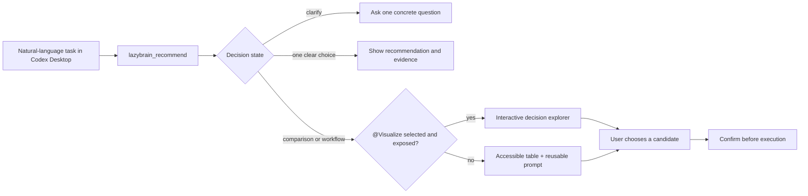

# LazyBrain in Codex Desktop

LazyBrain is designed to be used from a Codex Desktop task. Its local MCP server supplies a bounded capability snapshot; its bundled Skill decides whether the answer needs a simple recommendation, a comparison, a clarification question, or an interactive decision explorer. Capability descriptions remain untrusted display data, not instructions.

OpenAI's [`@Visualize` plugin](https://learn.chatgpt.com/docs/visualizations) performs the interactive rendering. LazyBrain does not pretend that JSON or terminal output is a mounted desktop interface.

## Product flow



## Interaction design

Analytical job: comparison/ranking with an optional ordered workflow.

Artifact family: a compact interactive decision explorer—not a dashboard.

Reading path:

1. Recommendation or clarification.
2. Visible evidence: score, reason, source, type, and platform.
3. At most two alternatives.
4. Optional ordered workflow.
5. Explicit confirmation boundary.

Useful controls are included only when there is enough data:

- single-select candidate control;
- kind and platform filters;
- workflow visibility toggle.

The selected card updates the detail view but never installs, enables, invokes, or executes a capability. Execution remains a separate user-authorized step in the conversation.

## Versioned payload

`lazybrain_recommend` keeps its existing structured decision fields and adds:

```json
{
  "desktopVisualization": {
    "schemaVersion": 1,
    "surface": "codex-desktop",
    "renderer": {
      "preferredPlugin": "@Visualize",
      "activation": "user-selected-in-composer",
      "availability": "preview",
      "fallback": "markdown-and-table"
    },
    "shouldRender": true,
    "artifact": {
      "family": "interactive-decision-explorer"
    },
    "candidates": [],
    "workflow": [],
    "controls": [],
    "interaction": {
      "selectionDoesNotExecute": true,
      "authorizationRequiredBeforeExecution": true
    },
    "visualizePrompt": "..."
  }
}
```

Generate the same contract directly for debugging:

```bash
lb desktop "review this payment PR safely" --json
lb desktop "review this payment PR safely" --visualize-prompt
```

## Install the local Codex plugin

```bash
npm ci
npm run build
npm link
codex plugin marketplace add .
codex plugin add lazybrain@lazybrain-local
```

Start a new Codex Desktop task after installation so it loads the updated Skill and MCP tools. For an interactive explorer, select `@Visualize` from the composer/plugin suggestions before sending that task.

Check the two plugins independently:

```bash
codex plugin list
```

Expected readback:

- `lazybrain@lazybrain-local` is installed and enabled;
- `visualize@openai-bundled` is installed and enabled when the preview is available in this environment.

Installed and enabled does not mean exposed to every task. The Visualizations preview can vary by account, workspace, app version, and rollout; the reliable per-task signal is that the user selected `@Visualize` in the composer and the host exposes it to that task. LazyBrain cannot activate another plugin from a background task.

## Failure states

| State | Behavior |
| --- | --- |
| Prompt is too broad | Ask the returned clarification question; do not render empty cards |
| One clear candidate, no workflow | Show the compact recommendation without forcing a visualization |
| Multiple candidates or multi-step workflow | Prefer the interactive decision explorer |
| `@Visualize` installed but not selected | Show the accessible table and exact prompt; do not claim a render occurred |
| `@Visualize` unavailable for the account/workspace | Render the same values as an accessible Markdown table |
| Visualization fails or is blank | Keep the fallback visible and offer the exact visualization prompt for retry |
| User selects a candidate | Explain the next plan and request authorization for external or destructive actions |

## Accessibility and trust

- Essential values remain visible without hover.
- Recommended state uses text and structure, not color alone.
- Keyboard navigation, visible focus, reduced motion, and a table fallback are part of the payload contract.
- The visualization uses only the supplied JSON snapshot; it must not fetch external data or invent capabilities.
- Strings originating in local capability metadata are bounded and treated as untrusted display data; embedded instructions must be ignored.
- Local capability metadata and history remain on the machine unless the user explicitly shares them in a conversation.

## Verification

```bash
npm run lint
npm run build
npx vitest run test/recommendation/desktop-visualization.test.ts test/mcp/server.test.ts test/cli/lifecycle.test.ts
lb desktop "review this payment PR safely" --json
```

The MCP readback can be verified in a fresh background task. A rendered-artifact claim additionally requires a user-created Codex Desktop task where `@Visualize` was selected in the composer and host readback shows the artifact. Text instructions alone are not evidence that the visualization plugin was exposed or invoked.
