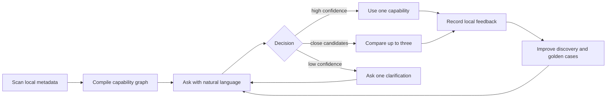

# LazyBrain Product Direction

## Product promise

LazyBrain is the Codex Desktop-first local capability control plane for AI coding agents:

> Describe the task. Get the best installed Skill, Plugin, MCP server, agent, command, or safe sequence—with evidence and no guessing.

It is not another marketplace or installer. Native ecosystems already distribute capabilities. LazyBrain solves the execution-time problem: remembering what is installed, understanding overlaps, and choosing the smallest useful capability for an imprecise request.

## Primary user

The initial user works in Codex Desktop and has accumulated enough Skills, Plugins, MCP servers, agents, and commands that names and boundaries are hard to remember. Claude Code users, teams curating a shared agent-tool stack, and other MCP clients are secondary surfaces.

## Core jobs

1. Inventory local capability metadata without uploading it.
2. Search by intent rather than exact command name.
3. Return one high-confidence recommendation, a short comparison, or one clarification question.
4. Build an advisory multi-capability order when the task genuinely needs it.
5. Turn comparisons and multi-step choices into a compact `@Visualize` decision explorer in Codex Desktop.
6. Learn from local accepted/ignored history without turning history into permission.

## Product loop

## Architecture boundary

- Scanner: extracts capability names, descriptions, compatibility, origins, versions, safe metadata, and MCP server names.
- Graph: stores normalized local capabilities and relationships.
- Matcher: deterministic triggers, examples, categories, negatives, and bounded history boost.
- Decision layer: converts ranked matches into `use`, `compare`, or `clarify`.
- Orchestrator: proposes an ordered or parallel plan; it never executes the plan.
- Surfaces: Codex Desktop plugin/Skill is primary; MCP is the integration boundary; CLI and Claude Code hook are support/compatibility surfaces.
- Visualization: a versioned `desktopVisualization` payload drives the installed OpenAI `@Visualize` plugin for comparisons and workflows; Markdown/table remains the canonical fallback.

## Non-goals

- Automatically installing arbitrary Skills, Plugins, or MCP servers.
- Executing a recommendation without user or host authorization.
- Uploading local capability content for cloud matching.
- Replacing native plugin marketplaces or the MCP Registry.
- Claiming an interactive visualization was rendered when only data or files were generated.

## Quality gates

- Top-match precision at least 88% on the maintained golden set.
- Average `find()` latency below 200 ms in the benchmark gate.
- Low-confidence vague prompts return `clarify`.
- Credential values from MCP configuration never enter scan output or the graph.
- Package, CLI, MCP, and plugin versions remain aligned.
- Every public release passes lint, tests, build, public-content audit, package inspection, install smoke, and independent review.

## Growth milestones

Stars are an outcome, not a quality metric the code can guarantee. The path to a credible 2,000-star project is:

1. Make the first useful recommendation work in under five minutes from install.
2. Publish reproducible before/after examples for Codex and Claude Code.
3. Turn false matches into small, reviewable golden cases.
4. Provide a clear contribution path for new sources, triggers, and workflow templates.
5. Track real adoption signals: successful first route, recommendation acceptance, repeat use, package downloads, contributor count, and issue resolution time.

Release candidates should not claim the 2,000-star milestone or broad ecosystem coverage until current evidence supports it.
