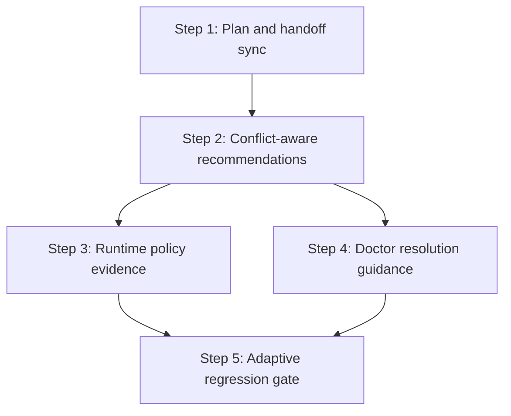

# LazyBrain Next-Stage Adaptive Routing Blueprint

Date: 2026-05-01
Branch: `codex/lazybrain-route-compile-split`
Mode: direct repo execution with split commit boundaries

## Objective

Turn the completed adaptive `ChoiceSet` work into a customer-ready adaptive choice layer:

- Recommendations include actionable model, mode, skill, and plugin choices.
- Skill/plugin/provider conflicts explain what to do next.
- Runtime policy keeps normal work automatic and pauses only for major decisions.
- Doctor output distinguishes ignorable duplicates from real conflicts.
- Regression gates prove matcher quality, conflict diagnostics, package safety, and release readiness.

## Current Baseline

- RouteSpec schema is `1.5.0`.
- CLI JSON, HTTP `/api/route`, MCP `lazybrain.route`, and MCP harness expose `choices`.
- Matcher benchmark is at 100% for top-1, top-3, Chinese top-1, and Chinese top-3.
- `doctor --all --json` reports `hookWarns: 0` and `capabilityWarns: 0`.
- Equivalent duplicate `frontend-design` and `setup` providers are informational, not blocking warnings.
- Release gate currently returns `READY`.

## Dependency Graph

## Step 1: Plan And Handoff Sync

Context brief:

- `docs/CODEX_HANDOFF.md` is the canonical tracked handoff.
- `.omc/progress.txt` is the local ignored phase log.
- `.omc/prd.json` tracks Ralph story completion.

Tasks:

- Add this blueprint under `plans/`.
- Update `docs/CODEX_HANDOFF.md` with the latest `642 tests` validation result.
- Record a local `.omc/progress.txt` checkpoint.

Verification:

- `git diff --check`
- Confirm `plans/lazybrain-next-stage-adaptive-routing.md` exists.

Exit criteria:

- Plan is self-contained enough for a cold agent to continue.
- Handoff does not contain stale validation counts.

Rollback:

- Revert the docs-only commit.

## Step 2: Conflict-Aware Recommendations

Context brief:

- Route conflict notices are built in `src/orchestrator/route.ts`.
- Public choice types live in `src/types.ts`.
- Existing tests live in `test/orchestrator/route.test.ts`.

Tasks:

- Add an optional actionable guidance field to conflict notices.
- Populate guidance for same-intent, registry conflict-group, and missing-capability cases.
- Keep existing `ChoiceSet` fields backward compatible.

Verification:

- `npm test -- test/orchestrator/route.test.ts`
- `npm run lint`

Exit criteria:

- Route JSON still works.
- Conflict notices tell the caller whether to auto-use the winner, install a missing capability, or avoid chaining conflicting providers.

Rollback:

- Revert the type and route-notice changes.

## Step 3: Runtime Policy Evidence

Context brief:

- Model and mode policy already lives in `src/orchestrator/route.ts`.
- High-risk handling is covered by route tests.

Tasks:

- Add regression assertions for the policy boundary:
  - normal route defaults to auto;
  - vague route asks first;
  - high-risk route asks first and keeps safer model choices visible.
- Avoid changing policy behavior unless tests expose a real gap.

Verification:

- `npm test -- test/orchestrator/route.test.ts`

Exit criteria:

- Runtime policy is explicitly covered and does not regress.

Rollback:

- Revert only the added regression assertions.

## Step 4: Doctor Resolution Guidance

Context brief:

- Capability conflicts are detected in `src/diagnostics/conflicts.ts`.
- CLI doctor output is assembled in `bin/lazybrain.ts`.
- Existing tests live in `test/diagnostics/conflicts.test.ts`.

Tasks:

- Add suggested actions to capability diagnostics.
- Add suggested actions to hook conflict diagnostics.
- Print concise guidance in human `lazybrain doctor` output.
- Preserve JSON shape compatibility by only adding optional fields.

Verification:

- `npm test -- test/diagnostics/conflicts.test.ts`
- `npm run build`
- `node dist/bin/lazybrain.js doctor --all --json`

Exit criteria:

- Equivalent duplicates say no action is required.
- Divergent provider conflicts tell the user how to choose or reprioritize.
- LazyBrain-owned hook conflicts point to `lazybrain doctor --fix`.

Rollback:

- Revert diagnostics and CLI rendering changes.

## Step 5: Adaptive Regression Gate

Context brief:

- `npm test`, `npm run lint`, `npm run audit:public`, package dry-run, and `ready --release` are the current release gates.
- Adaptive routing also needs focused gates for matcher quality and conflict diagnostics.

Tasks:

- Add a focused adaptive gate command that runs matcher, route, and conflict diagnostic regression tests.
- Include doctor warning summary evidence after build.
- Document the command in handoff.

Verification:

- `npm run gate:adaptive`
- `npm test`
- `npm run lint`
- `npm run audit:public`
- `npm pack --dry-run --json`
- `node dist/bin/lazybrain.js ready --release`

Exit criteria:

- One command verifies the adaptive routing surface before release.
- Full release checks remain green.

Rollback:

- Revert the script and `package.json` entry.

## Parallelism

- Step 2 and Step 4 touch related conflict fields and should run serially in one workspace to avoid type drift.
- Step 3 can be done after Step 2 with tests only.
- Step 5 depends on all prior behavior and must run last.

## Mutation Protocol

- Split a step if it grows beyond one focused commit.
- Insert a new step only when a failed verification exposes a real missing gate.
- Do not remove a safety gate to make release readiness pass.
- Do not auto-fix third-party plugin or hook state without an explicit customer decision.
